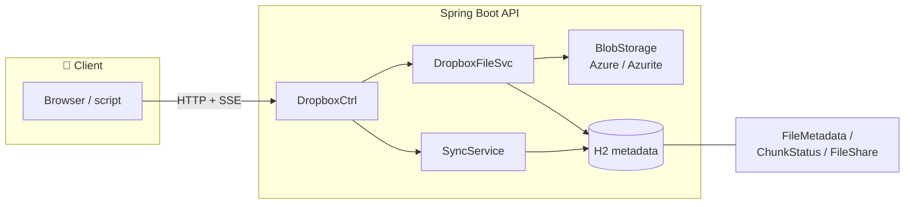
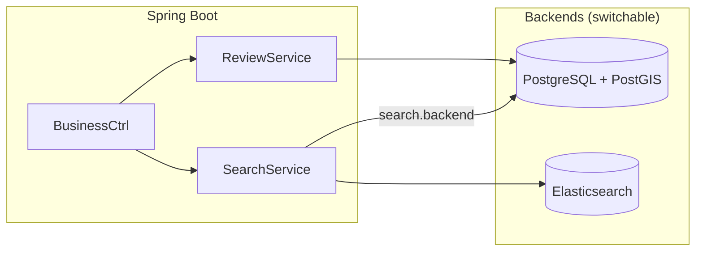
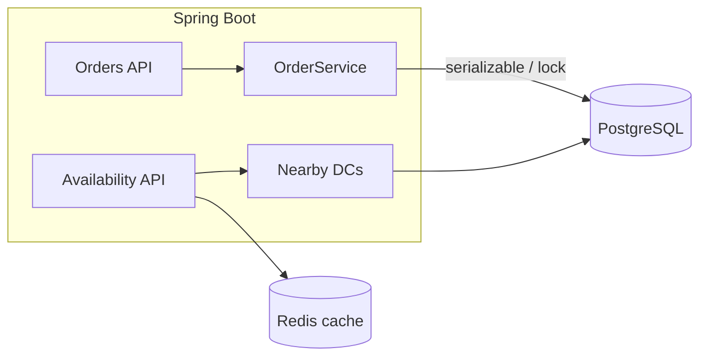

# System Design — Questions with Working Implementations

Interview-style **system design problems**, each backed by a **runnable implementation** — not slides or diagrams only.

This repo is for learning by building: classic questions (Dropbox, Yelp, GoPuff) plus supporting notes, and a related macOS product in the same workspace.

---

## Problems

| Question | Folder | Stack | What you can run |
|----------|--------|-------|------------------|
| [Design Dropbox](./dropbox-demo/README.md) | `dropbox-demo` | Spring Boot, Azure Blob (Azurite), H2 | Chunked upload, fingerprinting, dedup, sharing, SSE sync |
| [Design Yelp](./yelp-demo/README.md) | `yelp-demo` | Spring Boot, PostgreSQL/PostGIS, Elasticsearch | Geo + full-text search, reviews, precomputed ratings |
| [Design a local delivery service (GoPuff)](./gopuff-demo/README.md) | `gopuff-demo` | Spring Boot, PostgreSQL, Redis | Nearby DCs, availability union, atomic orders |
| Voice dictation (product) | `voice-dictation` | Swift, macOS | Menu-bar dictation: hotkey → transcribe → paste |

Design write-ups live next to the code (for example [`yelp-demo/Yelp.md`](./yelp-demo/Yelp.md)). Each project README covers architecture, APIs, and how to start it.

---

## Dropbox-like file storage

**Question:** Design a file storage system that supports upload, download, sharing, and sync across devices.

**Implementation:** [`dropbox-demo`](./dropbox-demo)

- Simple upload for small files; chunked Block Blob upload for large files
- Client-side SHA-256 fingerprinting for **deduplication** and **resumable** uploads
- Per-chunk hash verification and DB-tracked chunk status
- ACL-style sharing (`FileShare`) and **SSE** sync with a polling fallback
- Soft delete of metadata; blobs retained for recovery



```bash
cd dropbox-demo
docker compose up -d          # Azurite
./mvnw spring-boot:run        # http://localhost:8080
```

Details: [dropbox-demo/README.md](./dropbox-demo/README.md)

---

## Yelp-like business search

**Question:** Design a system to search businesses by name, location, and category, and to leave reviews.

**Implementation:** [`yelp-demo`](./yelp-demo)

- Search backends: **PostgreSQL + PostGIS** (default) or **Elasticsearch** (config flag)
- Geospatial radius search (`ST_DWithin` + GiST) and full-text search (`tsvector` + GIN)
- Precomputed `avgRating` / `numRatings`; one review per user per business
- Named location areas so searches can use “San Francisco” without polygon math on every request



```bash
cd yelp-demo
./start.sh                    # http://localhost:8081
```

Details: [yelp-demo/README.md](./yelp-demo/README.md) · design notes: [Yelp.md](./yelp-demo/Yelp.md)

---

## GoPuff-like local delivery

**Question:** Query item availability deliverable in about an hour, and place multi-item orders without double-booking.

**Implementation:** [`gopuff-demo`](./gopuff-demo)

- Nearby DCs: haversine, travel-time-all, or radius-pruned travel-time (default)
- Availability reads: Postgres or Redis cache with invalidation on order
- Orders: serializable Postgres transaction (default) or Redis distributed locks
- Switch strategies in `application.yml` (`gopuff.*`)



```bash
cd gopuff-demo
./start.sh                    # http://localhost:8082
```

Details: [gopuff-demo/README.md](./gopuff-demo/README.md) · design notes: [Gopuff.md](./gopuff-demo/Gopuff.md)

---

## Voice dictation (macOS)

Not a classic interview prompt; a **working macOS menu bar app** (WisprFlow-style): global hotkey, on-device speech recognition, optional LLM cleanup, paste at cursor.

```bash
cd voice-dictation
./run.sh
```

Details: [voice-dictation/README.md](./voice-dictation/README.md)

---

## Study notes

| File | Topic |
|------|--------|
| [`CAP.txt`](./CAP.txt) | Consistency vs availability heuristics |
| [`CoreConcepts.txt`](./CoreConcepts.txt) | Network essentials (in progress) |

---

## Prerequisites

| Project | Needs |
|---------|--------|
| Dropbox / Yelp / GoPuff demos | Java 21+, Docker, Maven wrapper (`./mvnw`) |
| Voice dictation | macOS 14+, Xcode command line tools |

---

## Repo layout

```
systemDesign/
├── dropbox-demo/        # Design Dropbox — Spring Boot + blob storage
├── yelp-demo/           # Design Yelp — search, geo, reviews
├── gopuff-demo/         # Design local delivery — availability + orders
├── voice-dictation/     # macOS dictation app
├── CAP.txt
└── CoreConcepts.txt
```

---

## Contributing

Work on a `feature/<topic>` branch and do not commit directly to `main`. Push the branch, then ask before merging into `main`.
